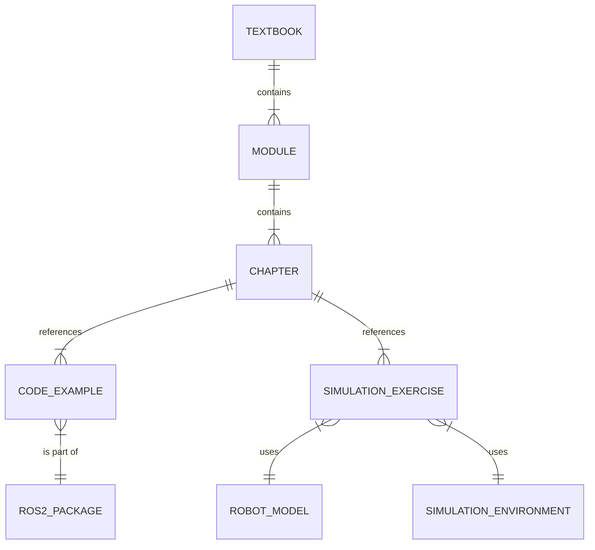

# Data Model: Robotics Textbook

This document outlines the key data entities for the "Physical AI & Humanoid Robotics Textbook". The textbook is structured as a collection of Markdown files, and this model describes the conceptual organization of the content.

## Entity Relationship Diagram (Conceptual)

## Entity Descriptions

### 1. Textbook

The root entity representing the entire book.

- **Attributes**:
    - `title`: string (e.g., "Physical AI & Humanoid Robotics: A Comprehensive Textbook")
    - `version`: string (e.g., "1.0.0")
    - `authors`: list of strings
    - `description`: string
    - `modules`: list of `Module` entities

### 2. Module

A major thematic section of the textbook.

- **Attributes**:
    - `id`: string (e.g., "module1-ros2")
    - `title`: string (e.g., "The Robotic Nervous System (ROS 2)")
    - `focus`: string (e.g., "Middleware for robot control")
    - `learning_outcomes`: list of strings
    - `chapters`: list of `Chapter` entities

### 3. Chapter

A detailed lesson within a module. Each chapter is a single Markdown file.

- **Attributes**:
    - `id`: string (e.g., "chapter1-intro")
    - `title`: string (e.g., "Introduction to ROS 2 – Overview and architecture")
    - `content`: string (Markdown format)
    - `code_examples`: list of `CodeExample` entities
    - `simulation_exercises`: list of `SimulationExercise` entities

### 4. Robot Model

The digital representation of the humanoid robot.

- **Attributes**:
    - `name`: string (e.g., "GenericHumanoidV1")
    - `urdf_file`: path to the URDF file
    - `description`: string
    - `specifications`: map (e.g., degrees of freedom, sensor suite)

### 5. Simulation Environment

The virtual world the robot interacts in.

- **Attributes**:
    - `name`: string (e.g., "BasicRoom")
    - `sdf_file`: path to the SDF file (for Gazebo)
    - `description`: string
    - `lighting`: map
    - `physics_properties`: map

### 6. ROS 2 Package

A self-contained software unit for a specific robotic capability.

- **Attributes**:
    - `name`: string (e.g., "simple_comm_pkg")
    - `version`: string
    - `dependencies`: list of strings
    - `nodes`: list of ROS 2 nodes
    - `launch_files`: list of launch files

### 7. VLA Model (Vision-Language-Action)

The AI model that translates natural language and/or visual input into robot actions.

- **Attributes**:
    - `name`: string
    - `source`: string (e.g., "Hugging Face")
    - `description`: string
    - `input_modalities`: list (e.g., "text", "voice", "vision")
    - `output_format`: string (e.g., "ROS 2 Action Goal")
